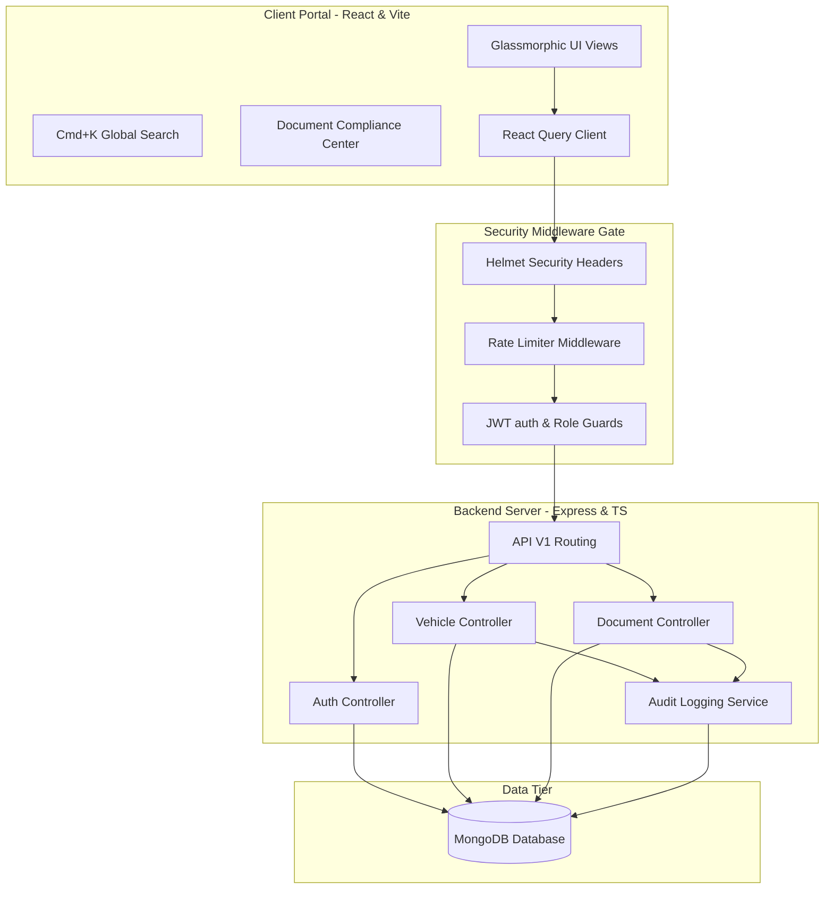

# TransitOps - Smart Transport Operations Platform

TransitOps is a production-grade Enterprise SaaS fleet management and smart transport operations platform built using the MERN stack (MongoDB, Express, React, Node.js) and TypeScript.

It provides real-time operational visibility, auto-dispatch routing, automated document compliance scanner pipelines, visual KPI analytics, command-line search overlays, and role-based access control (RBAC).

---

## 🏗️ System Architecture



### Components
1. **Frontend**: Vite-backed React SPA using pure CSS design, Lucide icons, and React Query client caching.
2. **Backend**: Express.js REST APIs in TypeScript, featuring custom security headers and token-bucket rate limiters.
3. **Authentication**: JWT authentication with local storage session tracking and Role-Based Access Control (RBAC).
4. **Database**: MongoDB utilizing indexing on query fields, managed via Mongoose schemas.
5. **Business Logic**: Document compliance scanning (expirations warnings), automated dispatch triggers, and audit logging.
6. **Reporting Exporter**: High-throughput PDF and CSV reporting streams.

---

## 📁 Workspace Folder Structure

```text
TransitOps/
├── client/                      # React Frontend SPA
│   ├── src/
│   │   ├── components/          # Reusable UI components
│   │   ├── context/             # Auth & Theme context providers
│   │   ├── layouts/             # AppLayout, bell center, Cmd+K search
│   │   ├── pages/               # Dashboard, Audit Logs, Document Center...
│   │   ├── services/            # Axios API client integrations
│   │   └── tests/               # Smoke test suites
│   ├── Dockerfile               # Client production Nginx Dockerfile
│   └── package.json
├── server/                      # Express Backend REST API
│   ├── src/
│   │   ├── config/              # MongoDB config & Swagger spec setup
│   │   ├── controllers/         # REST Controllers (Auth, Search, Document...)
│   │   ├── middlewares/         # JWT verification, RBAC, Rate limiter
│   │   ├── models/              # Mongoose database schemas
│   │   ├── routes/              # Express API endpoints
│   │   └── scripts/             # Database seeding & validation runners
│   ├── Dockerfile               # Backend production build Dockerfile
│   └── package.json
├── docker-compose.yml           # Orchestration setup for multi-containers
└── README.md                    # System documentation
```

---

## 🚀 Installation & Local Launch

### Prerequisites
- Node.js (v18+)
- MongoDB (running locally on port 27017 or remote Atlas connection string)
- Docker & Docker Compose (optional, for containerized run)

### Step 1: Clone and Configure Environment
Copy `.env.example` in the server and client subfolders:
```bash
# In server/
cp .env.example .env

# In client/
cp .env.example .env
```

### Step 2: Install dependencies
```bash
# Root or individual folders
cd server && npm install
cd ../client && npm install
```

### Step 3: Run Database Seeding
Initialize the base users and operations data logs:
```bash
# In server directory
npm run seed       # Creates Arthur, Guinevere, Lancelot, and Merlin
npm run seed-demo  # Restores operations metrics log
```

### Step 4: Run Development Servers
```bash
# In client/
npm run dev

# In server/
npm run dev
```
Open [http://localhost:5173](http://localhost:5173) in your browser.

---

## 🐳 Docker Deployment

To spin up the entire application stack (MongoDB database, Backend service, and Nginx client frontend) automatically:
```bash
docker-compose up --build -d
```
- Frontend will expose at [http://localhost](http://localhost) (port 80).
- Backend API will listen on [http://localhost:5000](http://localhost:5000).

---

## 📘 Interactive API Swagger Documentation
Explore and run tests directly against all REST endpoints using the Swagger OpenAPI playground:
- Staging/Local Endpoint: [http://localhost:5000/api/docs](http://localhost:5000/api/docs)
- Interactive features: Trigger user login, test request authentication headers, and fetch database summaries.

---

## 🧪 Running Verification Tests
Execute the custom end-to-end testing suites to verify integration:
```bash
# In server/
npm run test-api      # Runs health, Helmet headers, rate-limiting, and auth tests

# In client/
npm run test-smoke    # Runs entrypoint HTML and core page routes presence check
```
